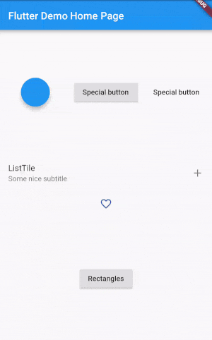

# pimp_my_button

A package which adds a much needed feature to all pressable objects.

# Showcase


# Features

- Highly customizable (Don't like my particle effects? Make your own with little effort!)
- Very easy to use
- A lot of premade particles

# Basics

The basic setup looks like this:

```
    PimpedButton(
      particle: DemoParticle(),
      pimpedWidgetBuilder: (context, controller) {
        return FloatingActionButton(onPressed: () {
          controller.forward(from: 0.0);
        },);
      },
    );
```
The `pimpedIwdgetBuilder` uses a builder which besides providing a new context, also provides an `AnimationController`.
When your button is pressed call this code:

```
controller.forward(from: 0.0);
```
It's important to include the `from` field because otherwise the animation won't play after the first tap.

The particle specified in the `PimpedButton` controlls what the animation looks like.

# Demo Particle Walk Through

We'll walk through how to build a `Particle` yourself, step by step. 

Here is what were are going to build:
Insert GIF


Each particle has to extend `Particle` and override this method:
`void paint(Canvas canvas, Size size, progress, seed)`
- Canvas is the canvas you can paint on
- The size is the bounding box of the the enclosing widget
- Progress is a double between 0 and 1, it reflects the progress in the animation
- The seed is an int value generated once for every tap. When dealing with randoms, initialize your
`Random` with that seed (so every frame is synced)

## The first particle
```
CompositeParticle(
  children: []
).paint(canvas, size, progressm seed);
```
You have to paint atleast one `Particle` in the paint(.,.,.,) method. Usually this would be the `CompositeParticle`.

The `CompositeParticle` doesn't do much on its own. It only paints all of its children.


## Adding actual particles

The next interesting particle is the `CircleMirror` and `RectangeMirror`.

```
    CircleMirror(
        numberOfParticles: 6,
        child: AnimatedPositionedParticle(
          begin: Offset(0.0, 20.0),
          end: Offset(0.0, 60.0),
          child: FadingRect(width: 5.0, height: 15.0, color: Colors.pink),
        ),
        initialRotation: -pi / randomMirrorOffset),
```
This mirrors its particle around the middle point in a circular shape.
In this case you provide one `Particle` which is going to be drawn multiple times, this means it's going to look
identical. If you want different particles (or the same with randomized values), use the `CircleMirror.builder`.

At the bottom of the hirarchy is the `FadingRect`, all it does is drawing a rectangle which fades out over time. 
To make it move, it's wrapped in an `AnimatedPositionedParticle`.

This is the full code.
```
class DemoParticle extends Particle {
  @override
  void paint(Canvas canvas, Size size, progress, seed) {
    Random random = Random(seed);
    int randomMirrorOffset = random.nextInt(8) + 1;
    CompositeParticle(children: [
      Firework(),
      CircleMirror(
          numberOfParticles: 6,
          child: AnimatedPositionedParticle(
            begin: Offset(0.0, 20.0),
            end: Offset(0.0, 60.0),
            child: FadingRect(width: 5.0, height: 15.0, color: Colors.pink),
          ),
          initialRotation: -pi / randomMirrorOffset),
      CircleMirror.builder(
          numberOfParticles: 6,
          particleBuilder: (index) {
            return IntervalParticle(
                child: AnimatedPositionedParticle(
                  begin: Offset(0.0, 30.0),
                  end: Offset(0.0, 50.0),
                  child: FadingTriangle(
                      baseSize: 6.0 + random.nextDouble() * 4.0,
                      heightToBaseFactor: 1.0 + random.nextDouble(),
                      variation: random.nextDouble(),
                      color: Colors.green),
                ),
                interval: Interval(
                  0.0,
                  0.8,
                ));
          },
          // division by 0 is not good ;)
          initialRotation: -pi / randomMirrorOffset + 8),
    ]).paint(canvas, size, progress, seed);
  }
}
```


# Notes

Some particles worth checking out:
- `IntervalParticle`, applies an interval and/or curve to the child.
- `FourRandomSlotParticle`, positions 4 children on the different sections.
- `PoppingCircle`, pretty popping circle


You are not restricted to use the particles in the context of "Pimp my button", the particles can be drawn on any regular canvas.


